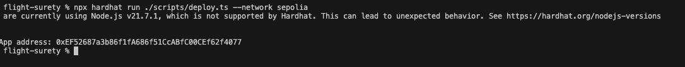
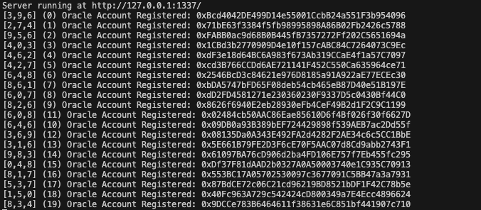
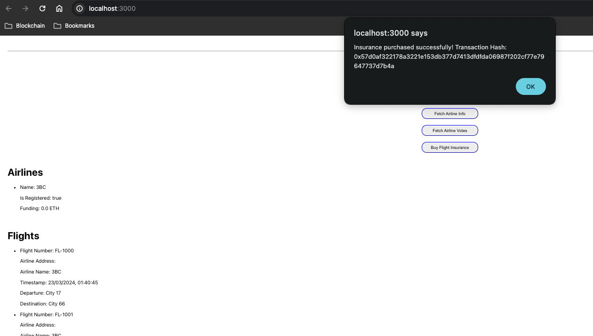
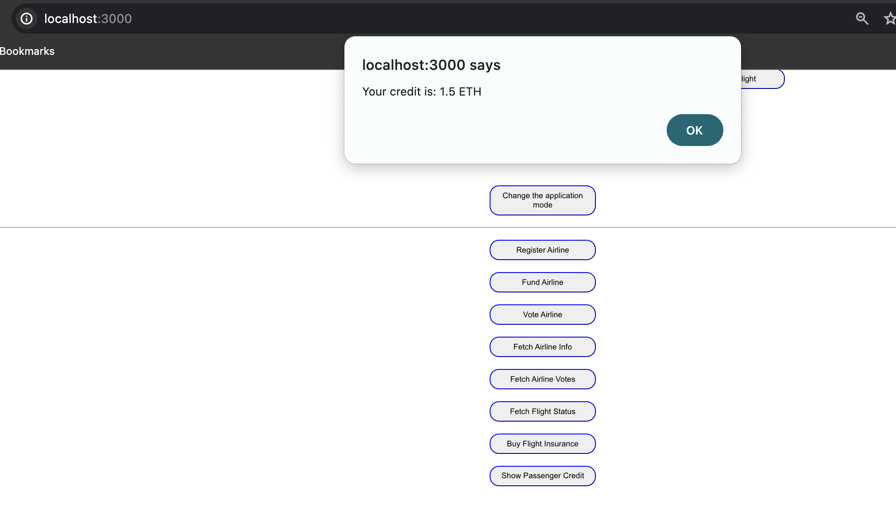

# FlightSurety

Here you can find outlines key information and provides instructions for setting up and interacting with the FlightSurety Project, a decentralized application (DApp) built on the Ethereum blockchain. FlightSurety is designed to automate flight insurance, leveraging smart contracts for operational integrity and security.

## Ethereum Contract and Transaction Links

Explore the FlightSurety smart contracts and transactions via these links on the Sepolia testnet:


## About FlightSurety

FlightSurety leverages the Ethereum blockchain to bring transparency and trust into flight insurance. It allows passengers to purchase insurance for their flights and receive automated payouts if their flights are delayed due to airline faults.

### Key Features and Roles

- **Smart Contract Logic**: Separated into data persistence and application logic for modularity and upgradeability.
- **Oracle Simulation**: External server application simulates oracle behavior for fetching and updating flight status information.
- **User Interaction**: Passengers can purchase flight insurance via a user-friendly DApp interface.

## Setting Up the Project

Follow these steps to set up and run the FlightSurety DApp:

1. **Clone the Repository**:
   ```
   git clone <repository-url>
   ```

2. **Install Dependencies**:
   - Navigate to the project's root directory:
     ```
     cd flight-surety
     ```
   - Install the required npm packages:
     ```
     npm install
     ```

3. **Compile Smart Contracts**:
   ```
   npx hardhat compile
   ```

### Script Descriptions

In this project, we've set up a series of npm scripts to streamline the development and deployment process for the FlightSurety DApp. Below, you'll find a brief description of each script, designed to help you understand and efficiently utilize them:

- **`server`**: Launches the backend server application located at `./apps/server/src/index.js`. Use this to start the server side of the DApp.

- **`compile`**: Removes existing compiled artifacts from the project and then compiles the smart contracts using Hardhat. This ensures that your contracts are up-to-date and ready for deployment or testing.

- **`dapp`**: Starts the frontend application of the DApp, which is located in the `./apps/frontend` directory. Use this command to launch the user interface in your browser.

- **`help`**: Displays a list of available npm scripts in the console. This is useful for getting a quick overview of the scripts you can run.

- **Deployment Scripts**:
    - **`deployLocalhost`**: Deploys the smart contracts to a local Ethereum network (Hardhat Network) running on your machine. This is useful for local development and testing.
    - **`deploySepolia`**: Deploys the smart contracts to the Sepolia test network. Use this for testing your contracts in a live, testnet environment.

- **Composite Scripts**:
    - **`flightsuretyLocalhost`**: A composite command that compiles your contracts, starts a local Ethereum node using Hardhat, deploys your contracts to this local node, and finally launches the DApp's frontend. This is your go-to script for quick, local development and testing cycles.
    - **`flightsuretySepolia`**: Similar to `flightsuretyLocalhost`, but instead of deploying to a local node, it deploys the contracts to the Sepolia test network. This script also compiles your contracts and starts the DApp's frontend, making it ideal for testing your application in a live, testnet environment before final deployment.

These scripts are designed to make the development, testing, and deployment process as smooth and efficient as possible. Whether you're working locally or preparing for a live testnet deployment, these commands provide a streamlined workflow for managing your DApp.
  ```
   npm run <command>
   ```

   **Run Tests**:
   - Ensure smart contract integrity through comprehensive tests:
     ```
     npx hardhat test
     ```

## Deployment Process
- **Compile Smart Contracts**: Initiates the compilation of smart contracts using Hardhat, which generates the necessary artifacts, including the ABI (Application Binary Interface) and bytecode.
- **Network Check**: Verifies the deployment network to prevent accidental deployments to the ephemeral Hardhat Network, suggesting the use of `--network localhost` for local deployments.
- **Fetch Signers**: Utilizes Hardhat's environment to obtain signer accounts, specifically identifying the deployer and an initial airline account for deployment purposes.
- **Deploy Contract**: Executes the deployment of the `FlightSuretyApp` contract to the chosen Ethereum network, leveraging the deployer account for the transaction.
- **Wait for Deployment Completion**: Awaits the finalization of the contract deployment process and then captures the contract's deployed address.
- **Artifact and Address Distribution**:
    - **Frontend Application**: The contract's ABI and address are saved in the `apps/frontend/src/artifacts/contracts` directory, ensuring the frontend application can properly interact with the deployed contract.
    - **Server Application**: Similarly, the artifacts are also placed in the `apps/server/src/artifacts/contracts` directory, enabling the server-side application to communicate with the contract.
    - **General Artifacts Storage**: Additionally, a copy of the contract's artifacts is stored in the general `artifacts/contracts` directory for reference or other uses.
- **Error Handling**: Manages and logs any errors encountered during the deployment process, facilitating debugging and ensuring smooth deployment operations.

## Using the FlightSurety DApp

- **Purchasing Insurance**: Passengers can select flights and purchase insurance through the DApp interface.
- **Checking Flight Status**: The Oracle server application simulates real-world flight information updates, triggering automatic insurance payouts as applicable.
- **Receiving Payouts**: In the event of a flight delay due to airline fault, insured passengers are automatically credited with payouts, which they can withdraw through the DApp.

## Development Environment

This project utilizes Hardhat as the primary development framework, given its powerful testing, debugging, and deployment features. Notably, Solidity version 0.8.20 is used for smart contract development, eliminating the need for the SafeMath library due to built-in overflow and underflow checks.

| Feature            | Screenshot                                       |
| ------------------ | ------------------------------------------------ |
| Deployment       |         |
| Oracle Registeration      |         |
| Purchase |  |
| Credit |    |


## Contributing

Contributions to the FlightSurety project are welcome. When contributing, please adhere to the following guidelines:
- Ensure code modifications are well-tested.
- Follow the existing coding style and practices.
- Update documentation as necessary to reflect changes.

Enjoy exploring and contributing to the FlightSurety project. For any queries or assistance, please reach out through the project's issue tracker or discussion forums.